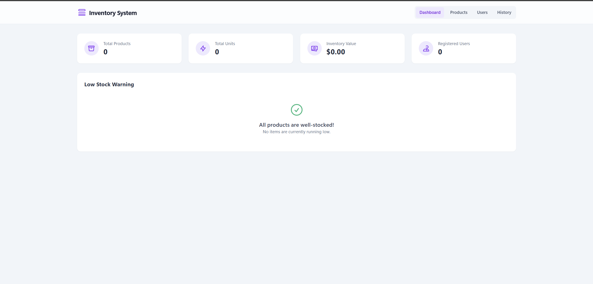

# Inventory Management System

A simple, modern, and client-side inventory management application built with React and Tailwind CSS. It allows users to register users and products, manage product stock, and view a history of all transactions. All data is persisted locally in the browser's `localStorage`.



## Features

- **User Management**: Register new users with a name and email.
- **Product Management**: Register new products with a SKU, name, price, and initial quantity.
- **Stock Adjustment**: Easily increase or decrease the quantity of any product. Stock levels cannot go below zero.
- **Product Status**: View a list of all products, their current stock, and the last time they were updated.
- **Transaction History**: A paginated log of all stock changes (initial, increase, decrease) for auditing purposes.
- **Local Persistence**: All data is automatically saved to your browser's `localStorage`, so it persists between sessions.
- **Responsive Design**: The interface is fully responsive and works beautifully on all screen sizes.

## Tech Stack

- **React**: A JavaScript library for building user interfaces, utilizing hooks (`useState`, `useEffect`, `useCallback`) for state and logic.
- **TypeScript**: Adds static typing to JavaScript for improved code quality and maintainability.
- **Tailwind CSS**: A utility-first CSS framework for rapid UI development, loaded via a CDN.
- **No Build Tools**: The project is intentionally kept simple by using CDN links for React and Tailwind, requiring no `npm` installation or bundling process.

## Setup and Run Instructions

Because this project uses ES modules and is designed for modern browsers without a build step, you'll need to serve the files using a local web server. Simply opening the `index.html` file directly in your browser will likely result in errors.

1.  **Download or Clone the Code:**
    Get a local copy of all the project files (`index.html`, `index.tsx`, etc.).

2.  **Navigate to the Project Directory:**
    Open your terminal or command prompt and change into the directory where you saved the files.

    ```bash
    cd path/to/your/project
    ```

3.  **Run a Local Web Server:**
    You can use any simple web server. Here are two common options:

    **Option A: Using Python (usually pre-installed on macOS/Linux)**

    ```bash
    # For Python 3
    python -m http.server
    ```

    **Option B: Using Node.js (if you have `npx`)**

    ```bash
    npm install --save-dev @types/react
    npm install react-dom
    npx serve
    ```

4.  **Open the App:**
    Once the server is running, open your web browser and navigate to the address shown in your terminal, which is typically `http://localhost:8000` or `http://localhost:3000`.

## Approach and Trade-offs

### Approach

- **Component-Based Architecture**: The application is broken down into logical React components (`Dashboard`,`ProductManagement`, `UserManagement`, `TransactionHistory`,) to keep the codebase organized and reusable.
- **Local State Simulation**: To fulfill the requirement of a "no backend" app, I simulated a database using the browser's `localStorage`. A custom hook, `useLocalStorage`, was created to abstract away the logic of reading from and writing to `localStorage`, making it as easy to use as React's native `useState` hook.
- **Utility-First Styling**: Tailwind CSS was chosen for styling to allow for rapid development and easy maintenance. The styles are co-located with their respective components, making them easy to reason about. Global styles are minimal.
- **Modern UI/UX**: The design is clean, modern, and intuitive. It includes clear feedback for user actions, thoughtful empty states to guide new users, and a responsive layout that adapts to different devices.

### Trade-offs

- **No Backend**: The most significant trade-off is the absence of a server and database.
  - **Pros**: Simplifies the setup immensely (no dependencies, no build process) and allows the app to function offline.
  - **Cons**: Data is not shareable between different users, devices, or even different browsers on the same machine. Data can be lost if the user clears their browser cache. This approach is only suitable for single-user, non-critical applications.
- **CDN-based Dependencies**: Using a CDN for React and Tailwind is great for quick prototypes and simple projects.
  - **Pros**: Zero build configuration is needed.
  - **Cons**: For a production application, this is not ideal. A build process using a tool like Vite or Next.js would provide crucial optimizations like code splitting, minification, and tree-shaking for better performance. It would also allow for a more robust module system and development environment (e.g., Hot Module Replacement).
- **Prop Drilling**: State is managed in the top-level `App` component and passed down to child components via props.
  - **Pros**: This is simple and easy to follow for a small application.
  - **Cons**: As an application grows, this can become cumbersome ("prop drilling"). For a larger app, a more sophisticated state management solution like React's Context API or a library like Zustand or Redux would be more appropriate.
